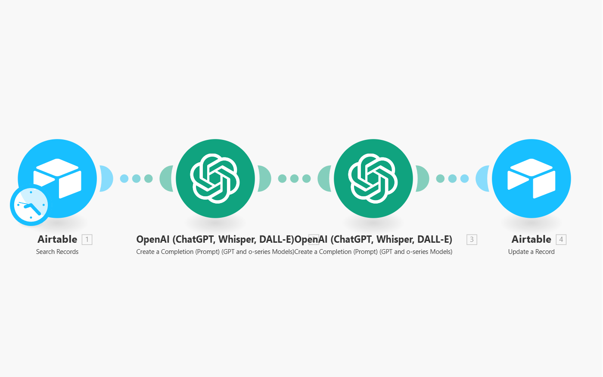

# 🔄 Airtable Record Update Automation with ChatGPT

## 📌 About

This project automates the process of searching and updating records in Airtable using **two ChatGPT completions**. It's designed to streamline data enrichment and management workflows by leveraging OpenAI's natural language capabilities within Airtable via Make.com.

---

## 🖼️ Screenshot

*This image shows a four-module scenario: Search Records → ChatGPT Completion → ChatGPT Completion → Update Record*

---

## ⚙️ Tools & Platforms

- **Make.com** – Visual automation platform
- **Airtable** – Cloud-based database platform
- **OpenAI (ChatGPT)** – Used for generating completions (GPT and o-series)

---

## 🧠 How It Works

1. **Search Records**
   - The scenario scans your Airtable base periodically, filtering for records that need updates or enrichment.

2. **First ChatGPT Completion**
   - The record data is sent to OpenAI to generate an initial prompt-based response—this could be used for classification, summaries, etc.

3. **Second ChatGPT Completion**
   - The output from the first completion is refined or passed into a second prompt for further enhancement or transformation.

4. **Update Record**
   - The enriched result is sent back to Airtable, updating the appropriate field(s) in the original record.

---

## 🔧 Use Cases

- Auto-classifying incoming form entries
- Enhancing or cleaning user-submitted data
- Generating insights from raw input fields

---

